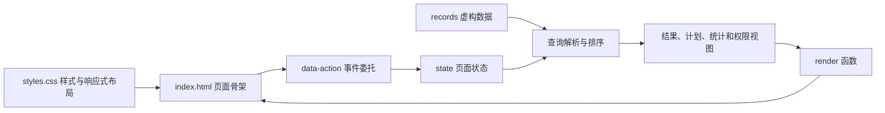
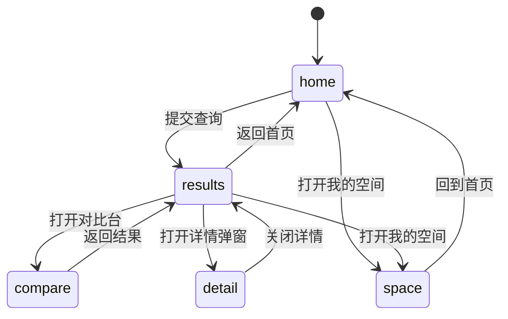
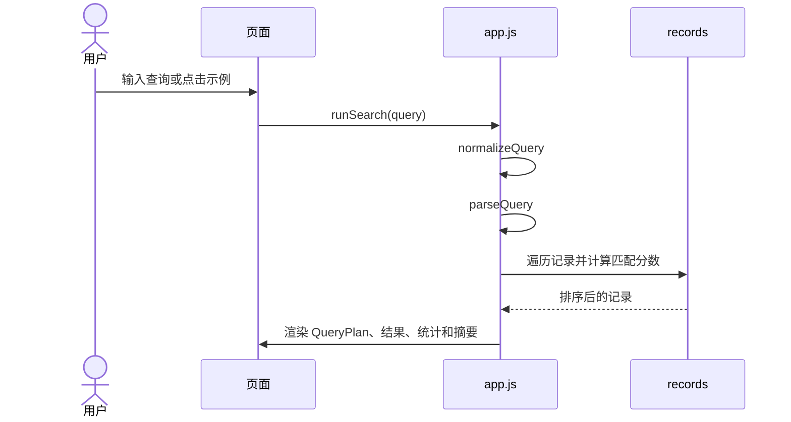
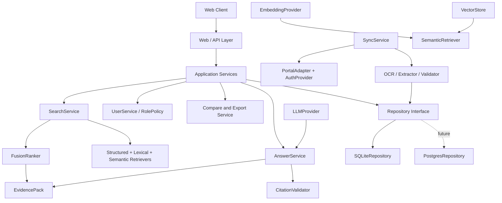
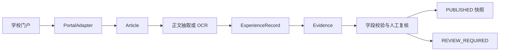
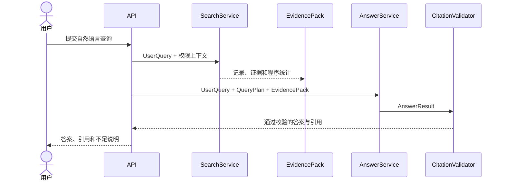

# 选调信息智能检索系统架构

当前版本 `v0.1.0-dev` 仍是静态 Demo。本文件同时记录两部分内容

- 当前已经落地的浏览器端实现
- 面向服务端版本的 V3 目标架构

两部分必须分开理解。文中标记为“目标”的模块不能当作已经接入的功能。

## 1. 架构约束

系统围绕可信检索设计，以下约束优先级高于单个功能的便利性

1. 已发布数据必须可以独立完成传统检索。
2. AI 只能使用检索服务整理出的证据，不能直接访问数据库、门户或生成 SQL。
3. 重要字段尽量保存字段级原始证据。资料缺失时保留“未提供”，不根据常识补值。
4. 权限由服务端策略决定，前端只负责展示服务端返回的视图。
5. 游客看到的是服务端生成的脱敏派生资源，原始海报和受限字段不能通过接口返回。
6. OCR、Embedding、LLM、CAS、通知等外部能力都必须可以替换或降级。
7. 新功能不能阻断传统检索、详情、统计和对比主链。

## 2. 当前 Demo 架构

当前版本没有后端。页面加载后，数据、状态、查询和渲染都在浏览器内完成。



### 2.1 文件职责

| 文件 | 当前职责 | 迁移时的去向 |
| --- | --- | --- |
| `index.html` | 页面结构、控件、弹窗和语义标记 | 保留为前端页面层，或拆成组件模板 |
| `styles.css` | 颜色、间距、组件状态和窄屏规则 | 保留为前端样式层 |
| `app.js` 中的 `records` | 3 条虚构记录和字段级证据 | 替换为 API 返回的 DTO |
| `app.js` 中的 `state` | 当前视图、搜索模式、角色、AI 开关、无痕状态和对比选择 | 拆为前端 UI 状态与服务端会话状态 |
| `runSearch` | 规范化、解析、筛选、排序和结果更新 | 迁移为服务端 `SearchService`，前端只发查询请求 |
| `renderResults`、`renderCompare`、`openDetail` | 结果、对比和详情视图渲染 | 保留展示职责，数据由接口提供 |
| `exportCurrent` | 根据当前视图生成 CSV | 正式版本由服务端校验导出范围，前端负责下载 |

### 2.2 当前数据模型

Demo 中每条 `record` 包含下面几组信息

| 分组 | 字段 |
| --- | --- |
| 标识 | `id` |
| 个人与教育 | `name`、`graduationYear`、`entryGrade`、`education`、`college`、`major`、`majorFamily` |
| 去向 | `region`、`city`、`organization`、`position` |
| 来源 | `sourceTitle`、`sourceDate`、`articleType`、`reviewStatus` |
| 展示 | `posterTone`、`tags`、`reasons` |
| 证据 | `evidence[]`，每项包含 `field`、`text` 和 `method` |

正式版本需要把这组前端对象拆成 `Article`、`ExperienceRecord`、`Evidence` 和派生资源对象。前端字段名可以继续沿用，字段含义要由统一数据字典维护。

### 2.3 当前交互状态



角色、AI 可用性和无痕模式是横跨这些视图的演示状态。它们会触发重新渲染，但当前不会建立登录会话或写入数据库。

## 3. 当前搜索流程

`app.js` 中的搜索流程是确定性的，主要函数及职责如下

| 函数 | 职责 |
| --- | --- |
| `normalizeQuery` | 去除首尾空白，统一部分标点和空格 |
| `parseQuery` | 识别学历、届别、专业、地区和基层意图，生成 QueryPlan |
| `getSearchTerms` | 从输入中提取已知词和自由关键词 |
| `matchesStructured` | 应用页面筛选器 |
| `matchesPlan` | 应用 QueryPlan 中的硬条件 |
| `scoreRecord` | 计算关键词、结构化字段和意图匹配分数 |
| `runSearch` | 组合上述步骤，排序并更新结果视图 |



当前 AI 模式和传统模式共享同一套前端筛选逻辑。AI 模式额外显示模板化的证据摘要，AI 关闭时隐藏摘要并保留相同的结果链路。

## 4. V3 目标架构

下面的分层是服务端版本的目标，不代表当前 Demo 已经完成。



### 4.1 分层职责

| 层 | 负责内容 | 不负责内容 |
| --- | --- | --- |
| Web / API | 参数校验、响应格式、认证上下文、错误映射 | 业务排序、OCR、提示词拼接 |
| Application | 编排搜索、详情、对比、导出和用户用例 | 绑定具体数据库或模型供应商 |
| Domain | 记录、证据、查询计划、权限策略和状态规则 | 页面渲染、HTTP 细节 |
| Search | 结构化检索、全文检索、语义检索和融合排序 | 生成答案、用户认证、同步门户 |
| RAG | 解释查询、消费 Evidence Pack、生成带引用答案 | 直接查数据库或补齐缺失字段 |
| Data processing | 获取内容、OCR、字段抽取、校验、人工复核 | 决定页面权限或答案措辞 |
| Infrastructure | SQLite、向量存储、门户认证、LLM、Embedding 和通知适配器 | 暴露给业务层的具体实现细节 |
| Frontend | 查询输入、结果展示、详情、对比和状态反馈 | 判断真实权限、生成脱敏原图 |

## 5. 数据域与生命周期

### 5.1 核心对象

#### `Article`

代表学校门户中的文章、帖子或海报来源。

建议字段包括

```text
article_id
source_type
source_url
title
publish_time
raw_content_ref
processing_status
content_hash
```

#### `ExperienceRecord`

代表从一篇来源中整理出的结构化经验记录。一篇 `Article` 可以对应多条记录。

建议字段包括

```text
record_id
article_id
name
graduation_year
education
college
major
region
city
organization
position
review_status
visibility
```

#### `Evidence`

记录一个字段的来源依据，是详情页、答案引用和人工复核的共同基础。

建议字段包括

```text
evidence_id
record_id
field_name
field_value
source_id
evidence_text
image_bbox
extraction_method
confidence
review_status
```

#### `EvidencePack`

由检索服务提供给 RAG 的受控输入。它只包含当前查询允许使用的记录、字段、证据片段和程序计算的统计值。

```text
query_id
query_plan
records[]
evidence[]
computed_statistics
```

### 5.2 数据状态

```text
DISCOVERED
  ↓
FETCHED
  ↓
EXTRACTED
  ↓
VALIDATED
  ↓
PUBLISHED
```

低置信度或字段冲突的数据进入 `REVIEW_REQUIRED`。公开检索默认只读取 `PUBLISHED` 快照。管理员可以查看待复核内容，但前台不能把待复核记录伪装成已发布信息。

### 5.3 数据处理流程



无法可靠识别的字段允许为空。抽取器可以提出候选值，不能用模型常识替换原文缺失内容。

## 6. 检索架构

### 6.1 统一入口

传统搜索和 AI 搜索都调用同一个 `SearchService`。差异位于查询理解和结果呈现层，检索结果必须共享同一套记录、权限过滤和证据链。

```text
UserQuery
  ↓
QueryNormalizer
  ↓
QueryPlan
  ↓
SearchService
  ├─ StructuredRetriever
  ├─ LexicalRetriever
  └─ SemanticRetriever，可插拔
  ↓
FusionRanker
  ↓
Authorized SearchResult + EvidencePack
```

### 6.2 中文传统检索

首版服务端可以采用 SQLite 和 FTS5。结构化字段先做精确或归一化匹配，正文和标题使用全文检索。短查询需要保留 LIKE 回退，避免中文短词在全文索引中的召回过低。

推荐流程如下

```text
全半角与标点归一化
  ↓
专业、地区和学历别名归一化
  ↓
结构化字段过滤
  +
FTS5 trigram 召回
  +
1 到 2 字查询的 LIKE 回退
  ↓
可解释的融合排序
```

业务层通过检索接口访问索引，不能直接拼接 SQL。具体索引方案、字段权重和评测集应在实现阶段记录到决策文档。

### 6.3 语义检索

语义检索是增强能力，不能成为首版运行前提。业务层只依赖下面的接口

```text
EmbeddingProvider
VectorStore
SemanticRetriever
```

初始实现可以使用本地 Embedding 和内存或 NumPy 向量存储。更换到 pgvector、Qdrant 或 Milvus 时，业务层不应跟着重写。

`VectorStore` 至少应支持

```text
upsert(document_id, vector, metadata)
delete(document_id)
search(query_vector, top_k, filters)
rebuild()
health_check()
```

### 6.4 融合排序

同时启用关键词和语义检索时，使用独立的 `FusionRanker` 合并候选结果。第一版优先采用容易解释和测试的 RRF 等方法，暂不设计大量未经评测的人工权重。

## 7. AI 与 RAG 边界



### 7.1 允许的输入与输出

`AnswerService` 的输入只能来自查询和证据包

```text
UserQuery
QueryPlan
EvidencePack
```

输出至少包含

```text
AnswerResult
  answer
  evidence_ids[]
  insufficient_evidence
  confidence
```

### 7.2 强制规则

- LLM 不直接访问 `Repository`、数据库、门户或 SQL。
- 统计数量、分布和比例由程序计算后注入证据包。
- 每个引用的 `evidence_id` 必须真实存在，并属于当前用户可见范围。
- 资料没有提供的字段必须明确显示缺失状态。
- RAG 服务不可用时，传统检索、详情、统计和对比继续工作。
- 模型生成内容需要经过引用校验，校验失败时返回可解释的失败状态。

## 8. 角色与资源权限

目标角色暂定为 `GUEST`、`STUDENT` 和 `ADMIN`。角色名称可以扩展，权限判断的入口保持统一。

| 角色 | 默认视图 | 主要能力 |
| --- | --- | --- |
| `GUEST` | 公开、脱敏视图 | 公开检索、基础结果、公开统计和脱敏详情 |
| `STUDENT` | 校内授权视图 | 授权字段、完整海报、收藏、搜索历史和关注 |
| `ADMIN` | 管理视图 | 同步、复核、发布、异常处理和管理日志 |

### 8.1 权限执行位置

权限判断必须经过后端 `RolePolicy`。前端可以根据返回结果调整界面，不能仅用 CSS、JavaScript 或隐藏按钮保护数据。

同一条 `ExperienceRecord` 保持一份业务数据。服务端根据角色生成不同的 `RecordView`，避免为游客和校内用户复制两套记录。

```text
ExperienceRecord
  ↓ RolePolicy + RecordPresenter
GUEST   → 脱敏字段和脱敏资源
STUDENT → 授权字段和完整资源
ADMIN   → 完整字段、证据和管理状态
```

### 8.2 海报资源

游客接口只能返回已经处理的派生文件

```text
poster_original
  ↓ SanitizationPipeline
poster_guest.webp
```

游客请求不能获得原始资源 URL。当前 Demo 的 CSS 遮罩只用于展示这条规则，不能直接迁移到正式系统。

### 8.3 无痕模式

无痕模式的目标行为是当前搜索不写入长期搜索历史、不更新用户画像、不产生长期推荐信号。它不等同于完全关闭安全审计日志，安全日志仍需遵守最小化和权限控制原则。

## 9. Repository 与外部适配器

业务服务不得直接绑定 SQLite、某一个向量库、某一家 LLM 或某一种 CAS 实现。

```text
Application Service
  ↓ interface
Repository / PortalAdapter / AuthProvider / LLMProvider / VectorStore
  ↓ implementation
SQLite / School Portal / CAS / External LLM / Vector Backend
```

首版可以从下面的实现开始

```text
Repository        → SQLiteRepository
PortalAdapter     → SchoolPortalAdapter
AuthProvider      → CASProvider
EmbeddingProvider → LocalEmbeddingProvider
VectorStore       → NumpyVectorStore
LLMProvider       → ConfiguredLLMProvider
```

接口的目的在于隔离变化。只有在具体实现已经成为真实约束时，才新增适配器，不为尚未确定的服务堆叠空壳模块。

## 10. 可靠性与降级

能力按依赖从少到多排列

```text
已发布本地数据
  ↓
结构化 + 关键词检索
  ↓
语义检索
  ↓
RAG 答案
```

上层能力失败时，系统退回下一层。至少应保证下面的故障不会让已发布数据消失

| 故障 | 处理方式 |
| --- | --- |
| LLM 不可用 | 隐藏或标记 AI 摘要，保留传统结果和证据详情 |
| Embedding 不可用 | 跳过语义召回，继续结构化和全文检索 |
| 门户认证失效 | 将同步任务标记为需要授权，继续提供上一份已发布快照 |
| OCR 或抽取置信度低 | 进入人工复核，禁止直接发布为确定字段 |
| 向量库不可用 | 暂停语义检索，不影响传统检索 |
| 通知服务不可用 | 保留关注关系，延迟发送通知，不影响检索 |

## 11. 从 Demo 迁移到服务端

| Demo 位置 | 服务端迁移方向 |
| --- | --- |
| `records` 数组 | `Article`、`ExperienceRecord`、`Evidence` 数据表和仓储接口 |
| `state.query` 与 `currentPlan` | 查询请求、服务端 `QueryPlan` 和返回的搜索上下文 |
| `runSearch` | `SearchService.search()` |
| `scoreRecord` | 结构化过滤、FTS5 召回和 `FusionRanker` |
| `displayName` 与 `posterMarkup` | `RolePolicy`、`RecordPresenter` 和脱敏资源服务 |
| `renderAnswer` | `AnswerService`、`EvidencePack` 和 `CitationValidator` |
| `exportCurrent` | 经过权限校验的导出服务 |
| `toggleAi` | 服务健康状态和前端降级提示 |
| `toggleNoTrace` | 用户会话选项与历史记录策略 |
| `data-role` 角色按钮 | CAS/SSO 登录后的服务端身份，不保留前端伪造入口 |

推荐迁移顺序是先替换数据来源，再迁移传统检索，接着补充服务端权限和脱敏，最后接入语义检索与 RAG。每一步都要保留可运行的传统检索路径。

## 12. 安全底线

- 数据库查询使用参数化接口。
- HTML 和富文本输出经过转义或白名单清洗。
- API Key、CAS 凭证和 Cookie 只存在于服务端环境变量或密钥管理系统。
- 用户输入限制长度、格式和请求频率。
- 受限字段和敏感资源由服务端过滤。
- 生产环境关闭 Debug，错误响应不返回堆栈信息。
- 日志不记录密码、Cookie、完整个人信息和原始敏感内容。
- 导出接口重新执行权限校验，不能信任前端传入的记录 ID 列表。

## 13. 当前不做

在团队正式调整范围前，当前版本不引入下面内容

```text
复杂微服务拆分
Redis 或消息队列
完整 Elasticsearch 集群
强依赖独立向量数据库
AI Agent 自动执行高风险操作
任意文件上传和文件内容搜索
复杂社交系统
自建学校账号密码认证
```

这些内容可以在需求稳定、评测数据和部署约束明确后重新讨论。

## 14. 架构变更规则

下面内容属于架构基线，修改前需要先写清楚现有问题、候选方案、影响范围、迁移成本和风险

```text
公共数据模型
公共接口
技术栈
Repository 边界
认证方式
权限模型
检索主链
Evidence 与 RAG 规约
```

团队确认后，再更新本文件和对应决策记录，最后开始代码改动。AI 编程助手发现当前任务与这些规则冲突时，应停在说明和建议阶段，不自行替换技术栈或扩大范围。


